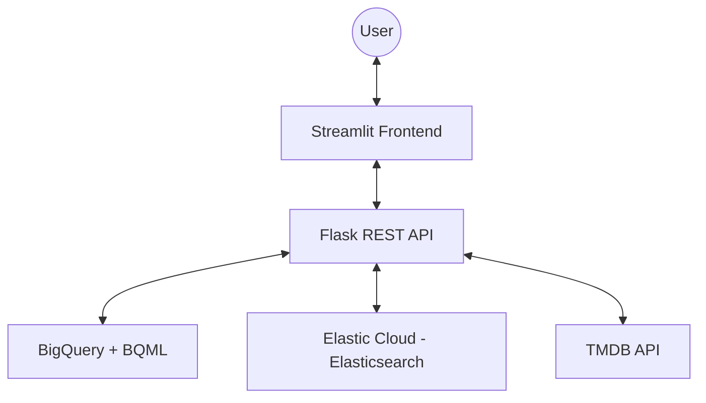

# MovieFinder — Cloud & Advanced Analytics Assignment 2

A 2-tier movie recommendation application featuring a **Flask REST API** backend and a **Streamlit** frontend. 
Enhancements include **Elasticsearch** for search-as-you-type autocomplete and **BigQuery ML** for personalized recommendations.

## Architecture



## Features

- **Autocomplete**: Search-as-you-type powered by Elasticsearch `search_as_you_type` mapping.
- **Recommendations**:
  1. **Similar Users**: Finds TOP 10 users with similar tastes (common movies rated >= 3.5).
  2. **BigQuery ML**: Uses `matrix_factorization` model to predict ratings for similar users.
  3. **Fallback**: Collaborative filtering via SQL if BQML is unavailable, and Global Top-Rated as a final fallback.
- **Netflix Theme**: Dark mode UI with movie posters and genre pills.
- **SQL Transparency**: Backend prints all executed BigQuery SQL to terminal for audit.

## Prerequisites

- **Python 3.11+**
- **Docker & Docker Compose**
- **GCP Project** with BigQuery and BQML access.
- **Elastic Cloud** instance with API Key.
- **TMDB API Key** (from Assignment 1).

## Local Setup

1. **Clone the repository**:
   ```bash
   cd assignment_2
   ```

2. **Configure environment variables**:
   Create a `.env` file based on `.env.example`.

3. **Train the BigQuery ML Model**:
   Execute the code in `backend/train_model.sql` manually in your BigQuery console.

4. **Index movies into Elasticsearch**:
   ```bash
   cd backend
   pip install -r requirements.txt
   python index_movies.py
   ```

5. **Run with Docker Compose**:
   ```bash
   docker-compose up --build
   ```

## Development

- **Backend**: [http://localhost:5000](http://localhost:5000)
- **Frontend**: [http://localhost:8501](http://localhost:8501)

## Authors
Marcelo Gonçalves
